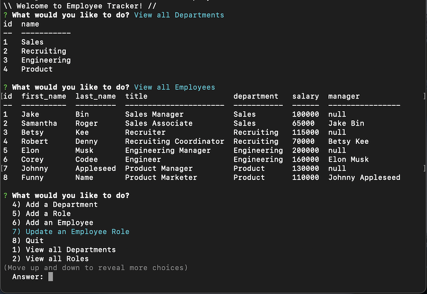

# Employee Tracker

## Description
This employee tracker helps business owners view and manage the departments, roles, and employees in their companies so that they can organize and plan their businesses. 

## Table of Contents
- [Usage](#usage)
- [Credits](#credits)
- [Features](#features)
- [Access](#access)

## Usage
- Select the option you would like to proceed with (view/add/update)
- Follow the prompts to successfully keep your data up-to-date
- Enjoy having all the information saved in one place
- Use quit option to exit and changes will be saved!

## Credits
This was based off of learnings from a course with topic regarding Express.js, MySQL, and Inquirer packages. 

## Features
- View database tables and make changes!
- Easily update roles and managers when employees shift around
- Use and enjoy!

## Access
[Click to View Repository](https://github.com/johnpow/employee-tracker-mysql)

[Click for Video Walkthrough](www.google.com)
